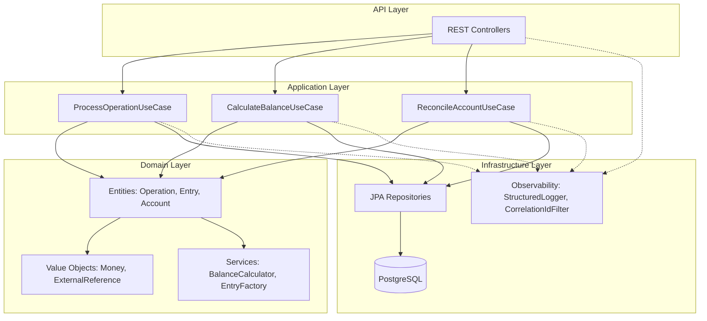
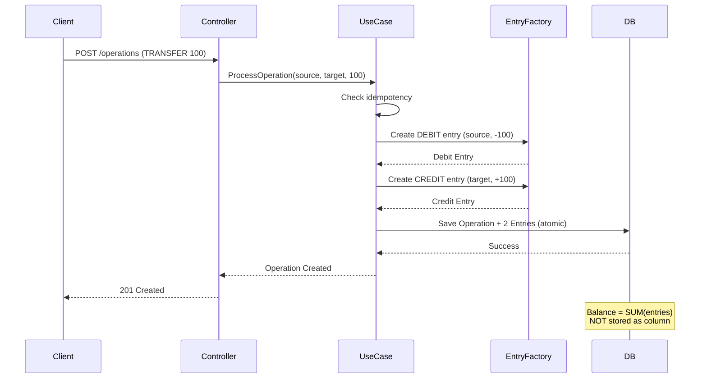
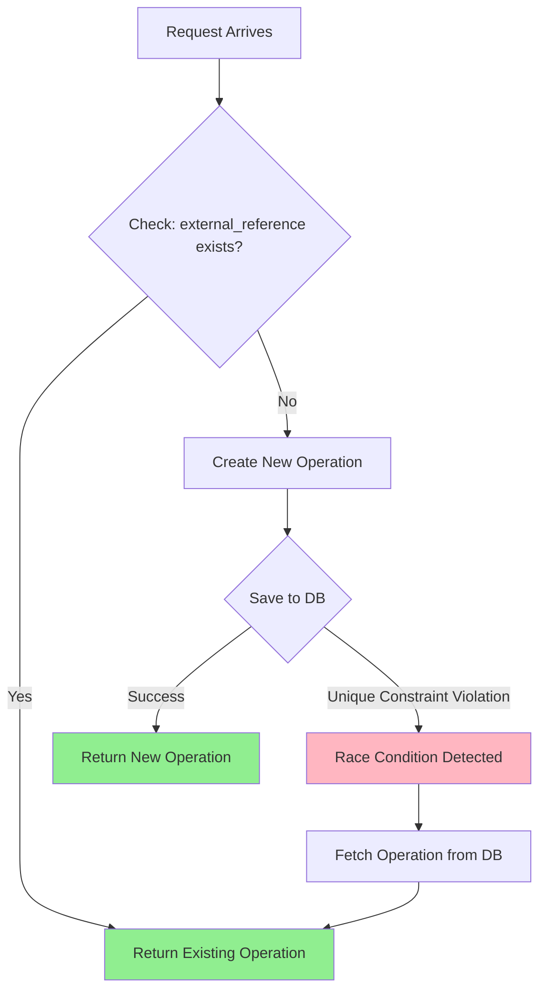
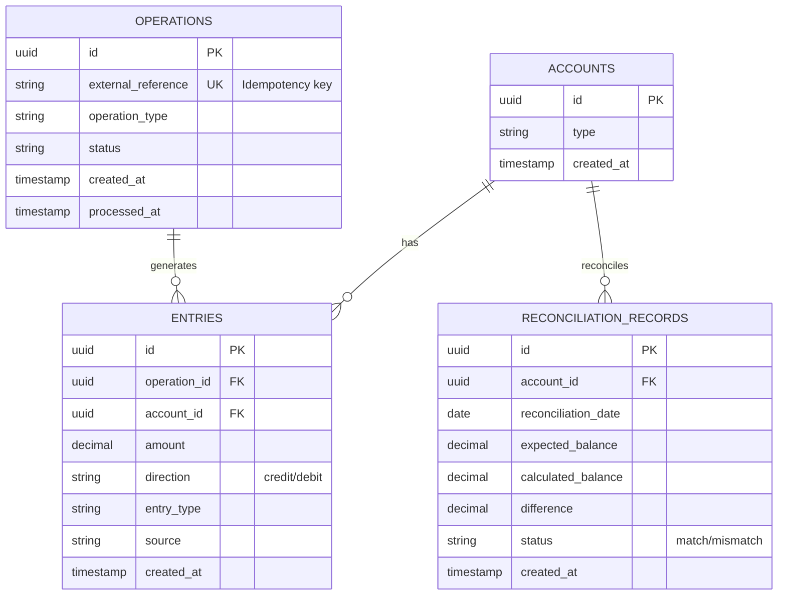

# 🏦 Ledger Service

> **Financial Ledger Simulator** demonstrating robust distributed systems patterns for production-grade financial operations.

[](https://openjdk.org/projects/jdk/21/)
[](https://spring.io/projects/spring-boot)
[](https://www.postgresql.org/)
[](./src/test)

---

## 📋 Table of Contents

- [What is This?](#what-is-this)
- [Core Principles](#core-principles)
- [Architecture](#architecture)
- [Key Features](#key-features)
- [Quick Start](#quick-start)
- [API Endpoints](#api-endpoints)
- [Testing](#testing)
- [Tech Stack](#tech-stack)
- [Project Structure](#project-structure)

---

## 🎯 What is This?

This is a **financial ledger simulator** built to demonstrate engineering patterns used in production fintech systems. It's **not a commercial product** — it's a technical showcase of how to handle real-world distributed systems challenges:

- ✅ **Idempotency** - Same operation N times = same result
- ✅ **Double-entry bookkeeping** - Balance is calculated, not stored
- ✅ **Race condition tolerance** - Handles concurrent duplicate requests
- ✅ **Reconciliation** - Detects divergences between expected and calculated balances
- ✅ **Observability** - Structured logging with correlation ID propagation
- ✅ **Failure simulation** - Test endpoints for stress testing

### What This is NOT:

❌ A payment gateway  
❌ A production banking system  
❌ A commercial product  

### What This IS:

✅ A demonstration of financial engineering patterns  
✅ A showcase of distributed systems resilience  
✅ A reference implementation for idempotent operations  

---

## 🧠 Core Principles

These principles are **non-negotiable** in financial systems:

### 1. **Money is NOT Mutable State**

```java
// ❌ WRONG - Never do this
UPDATE accounts SET balance = balance + 100 WHERE id = '123';

// ✅ RIGHT - Balance is calculated from entries
SELECT SUM(amount) FROM entries WHERE account_id = '123';
```

**Why?** If a transaction fails midway, you can't "undo" a balance update. With entries, you have a complete audit trail.

### 2. **Idempotency is Mandatory**

```java
// Same external_reference = same result
POST /operations { "externalReference": "PAY-001", "amount": 100 }
POST /operations { "externalReference": "PAY-001", "amount": 100 }
// Both return THE SAME operation ID
```

**Why?** Webhooks retry. Networks are unreliable. The same request may arrive multiple times.

### 3. **Order is NOT Guaranteed**

```java
// Operations may arrive out of order
Operation 1: timestamp=10:00 (arrives at 10:05)
Operation 2: timestamp=10:01 (arrives at 10:02)
// System must produce consistent results regardless
```

**Why?** Distributed systems are asynchronous. You can't rely on arrival order.

### 4. **Divergence is Expected**

```java
// Reconciliation detects but does NOT auto-correct
Expected:   1000.00
Calculated:  950.00
Action:     LOG DIVERGENCE → Manual investigation
```

**Why?** Auto-correction can hide bugs. Divergences must be investigated, not masked.

---

## 🏗️ Architecture

### High-Level Architecture



### Double-Entry Bookkeeping Flow



### Idempotency Pattern



### Data Model



---

## ✨ Key Features

### 1. **Idempotent Operations**

Send the same operation 100 times in parallel — only 1 is created:

```bash
curl -X POST http://localhost:8080/api/v1/simulation/duplicate \
  -H "Content-Type: application/json" \
  -d '{
    "externalReference": "STRESS-001",
    "type": "DEPOSIT",
    "targetAccountId": "11111111-1111-1111-1111-111111111111",
    "amount": 10.00,
    "parallelRequests": 100
  }'
```

**Result:**
```json
{
  "parallelRequests": 100,
  "uniqueOperationsCreated": 1,
  "duplicatesDetected": 99,
  "message": "Idempotency working! 100 parallel requests resulted in 1 operation(s)"
}
```

### 2. **Real-time Balance Calculation**

Balance is **always calculated**, never stored:

```sql
-- This is what happens under the hood
SELECT SUM(amount) FROM entries WHERE account_id = ?
```

**Why?** Guarantees consistency. No risk of balance going out of sync with entries.

### 3. **Reconciliation System**

Detect divergences between expected vs calculated balances:

```bash
curl -X POST http://localhost:8080/api/v1/reconciliation \
  -H "Content-Type: application/json" \
  -d '{
    "accountId": "11111111-1111-1111-1111-111111111111",
    "expectedBalance": 150.00
  }'
```

**If divergence exists:**
```json
{
  "status": "MISMATCH",
  "expectedBalance": 150.00,
  "calculatedBalance": 100.00,
  "difference": -50.00,
  "isMismatch": true
}
```

### 4. **Structured Logging with Correlation ID**

Every request gets a correlation ID for distributed tracing:

```
2025-12-14 20:00:00 [abc-123-def] INFO - Operation received: externalReference=DEP-001
2025-12-14 20:00:01 [abc-123-def] INFO - Operation processed: operationId=uuid-456
```

Pass your own correlation ID:
```bash
curl -H "X-Correlation-ID: my-trace-id" http://localhost:8080/api/v1/operations
```

---

## 🚀 Quick Start

### Prerequisites

- Java 21
- Docker (for PostgreSQL)
- Maven 3.9+

### 1. Start PostgreSQL

```bash
docker compose up -d
```

### 2. Run the Application

```bash
./mvnw spring-boot:run
```

### 3. Verify Health

```bash
curl http://localhost:8080/actuator/health
```

Expected response:
```json
{
  "status": "UP"
}
```

### 4. Access Swagger UI

Open in browser:
```
http://localhost:8080/swagger-ui.html
```

---

## 📡 API Endpoints

### **Core Operations**

| Method | Endpoint | Description |
|--------|----------|-------------|
| `POST` | `/api/v1/operations` | Create financial operation (deposit/withdrawal/transfer) |
| `GET` | `/api/v1/accounts/{id}/balance` | Calculate account balance in real-time |
| `POST` | `/api/v1/reconciliation` | Reconcile account (compare expected vs calculated) |
| `GET` | `/api/v1/reconciliation/{accountId}` | Get reconciliation history |
| `GET` | `/api/v1/reconciliation/dashboard` | View reconciliation statistics |
| `GET` | `/api/v1/reconciliation/divergence/{id}` | Analyze specific divergence |

### **Simulation Endpoints (Failure Testing)**

| Method | Endpoint | Description |
|--------|----------|-------------|
| `POST` | `/api/v1/simulation/duplicate` | Test idempotency (N parallel identical requests) |
| `POST` | `/api/v1/simulation/out-of-order` | Test order independence |
| `POST` | `/api/v1/simulation/delayed` | Test async processing with delays |
| `POST` | `/api/v1/simulation/retry` | Test webhook retry scenarios |

### **Observability**

| Method | Endpoint | Description |
|--------|----------|-------------|
| `GET` | `/actuator/health` | Health check |
| `GET` | `/actuator/info` | Application info |
| `GET` | `/actuator/metrics` | Metrics |
| `GET` | `/actuator/prometheus` | Prometheus format metrics |

---

## 🧪 Testing

### Run All Tests

```bash
./mvnw clean test
```

**Expected output:**
```
Tests run: 41, Failures: 0, Errors: 0, Skipped: 0
BUILD SUCCESS
```

### Test Scenarios

#### 1. **Happy Path: Deposit + Transfer**

```bash
# 1. Make a deposit
curl -X POST http://localhost:8080/api/v1/operations \
  -H "Content-Type: application/json" \
  -d '{
    "externalReference": "DEP-001",
    "type": "DEPOSIT",
    "targetAccountId": "11111111-1111-1111-1111-111111111111",
    "amount": 100.00
  }'

# 2. Check balance
curl http://localhost:8080/api/v1/accounts/11111111-1111-1111-1111-111111111111/balance

# 3. Make a transfer
curl -X POST http://localhost:8080/api/v1/operations \
  -H "Content-Type: application/json" \
  -d '{
    "externalReference": "TRF-001",
    "type": "TRANSFER",
    "sourceAccountId": "11111111-1111-1111-1111-111111111111",
    "targetAccountId": "22222222-2222-2222-2222-222222222222",
    "amount": 30.00
   }'
```

#### 2. **Test Idempotency**

```bash
# Send same operation twice
for i in {1..2}; do
  curl -X POST http://localhost:8080/api/v1/operations \
    -H "Content-Type: application/json" \
    -d '{
      "externalReference": "IDEM-001",
      "type": "DEPOSIT",
      "targetAccountId": "11111111-1111-1111-1111-111111111111",
      "amount": 50.00
    }'
done
```

**Both requests return the same `operationId`!**

#### 3. **Test Reconciliation**

```bash
# Reconcile with correct balance
curl -X POST http://localhost:8080/api/v1/reconciliation \
  -H "Content-Type: application/json" \
  -d '{
    "accountId": "11111111-1111-1111-1111-111111111111",
    "expectedBalance": 120.00
  }'
```

### Integration Tests

The project includes comprehensive integration tests using **Testcontainers**:

- `DuplicateOperationIntegrationTest` - Stress tests with 100+ parallel requests
- `ProcessOperationUseCaseTest` - Use case behavior verification
- `CalculateBalanceUseCaseTest` - Balance calculation correctness

See [`TESTING_GUIDE.md`](./TESTING_GUIDE.md) for detailed test scenarios.

---

## 🛠️ Tech Stack

| Layer | Technology |
|-------|-----------|
| **Language** | Java 21 |
| **Framework** | Spring Boot 4.0.0 |
| **Database** | PostgreSQL 16 |
| **Migration** | Flyway |
| **API Documentation** | SpringDoc OpenAPI 2.7.0 |
| **Testing** | JUnit 5 + Testcontainers |
| **Observability** | SLF4J + Logback, Spring Actuator |
| **Build Tool** | Maven 3.9+ |

### Why These Choices?

- **Java 21**: Virtual threads for high concurrency simulation
- **Spring Boot 4.0**: Latest framework with modern patterns
- **PostgreSQL**: ACID transactions, perfect for financial data
- **Flyway**: Version-controlled database migrations
- **Testcontainers**: Real database in tests, not mocks

---

## 📁 Project Structure

```
ledger-service/
├── src/main/java/com/ledgerservice/
│   ├── api/                          # REST Controllers, DTOs
│   │   ├── controllers/
│   │   └── dtos/
│   ├── application/                  # Use Cases (orchestration)
│   │   └── usecases/
│   ├── domain/                       # Business logic (framework-free)
│   │   ├── entities/
│   │   ├── valueobjects/
│   │   ├── services/
│   │   ├── enums/
│   │   └── exceptions/
│   └── infrastructure/               # Technical concerns
│       ├── persistence/              # JPA entities, repositories
│       └── observability/            # Logging, correlation ID
├── src/main/resources/
│   └── db/migration/                 # Flyway SQL migrations
└── src/test/                         # Integration tests
```

### Architectural Layers

```
┌─────────────────────────────────────────┐
│         API Layer (Controllers)         │  ← HTTP, JSON, DTOs
├─────────────────────────────────────────┤
│    Application Layer (Use Cases)        │  ← Orchestration
├─────────────────────────────────────────┤
│    Domain Layer (Business Rules)        │  ← Framework-free!
├─────────────────────────────────────────┤
│  Infrastructure (Persistence, Logging)  │  ← Technical details
└─────────────────────────────────────────┘
```

**Key principle:** Domain layer has **zero** framework dependencies.

---

## 📊 Observability

### Structured Logging

All business events are logged in a structured format:

```
2025-12-14 20:00:00 [correlation-id] INFO - Operation received: externalReference=DEP-001, amount=100.00, event=operation.received

2025-12-14 20:00:01 [correlation-id] INFO - Operation processed: operationId=uuid-123, event=operation.processed

2025-12-14 20:00:02 [correlation-id] WARN - Reconciliation mismatch: expectedBalance=150.00, calculatedBalance=100.00, difference=-50.00, event=reconciliation.mismatch
```

### Correlation ID Propagation

Every request gets a correlation ID that propagates through all logs:

```bash
curl -H "X-Correlation-ID: my-trace-123" \
  http://localhost:8080/api/v1/operations
```

All logs for this request will include `[my-trace-123]`.

### Metrics

Access Prometheus-compatible metrics:

```bash
curl http://localhost:8080/actuator/prometheus
```

---

## 🎯 Business Rules Implemented

### Idempotency Strategy

```java
// Enforced at database level
operations.external_reference → UNIQUE constraint

// Enforced at application level
1. Check if external_reference exists
2. If yes → return existing operation
3. If no → create new operation
4. If race condition → PostgreSQL rejects duplicate
5. Retry fetch → return operation that won the race
```

### Double-Entry Bookkeeping

```java
// Every operation creates balanced entries
DEPOSIT:   +100 to target account
WITHDRAWAL: -100 from source account
TRANSFER:  -100 from source, +100 to target

// Invariant: SUM(all entries) = 0 (globally)
```

### Reconciliation Logic

```java
calculatedBalance = SUM(entries WHERE account_id = ?)
difference = expectedBalance - calculatedBalance

if (difference == 0) → MATCH
if (difference != 0) → MISMATCH → Log for investigation
```

---

## 🚦 Next Steps (Roadmap)

This project deliberately omits some production features to keep focus on core patterns:

### What's Missing (by design):

- ❌ Authentication/Authorization (not the focus)
- ❌ Rate limiting (simplicity over completeness)
- ❌ Event sourcing (kept simple with double-entry)
- ❌ Distributed transactions (single DB by design)
- ❌ Cache layer (prioritizes clarity over performance)

### What Could Be Added:

- 🔄 Webhook notifications on reconciliation mismatch
- 📊 Grafana dashboards for metrics
- 🔍 Distributed tracing with OpenTelemetry
- 📝 Comprehensive API documentation (Postman collection)
- 🐳 Kubernetes deployment manifests

---

## 📄 License

This is a technical demonstration project. Feel free to use the patterns and ideas in your own projects.

---

## 🙋 Questions?

For detailed testing scenarios, see: [`TESTING_GUIDE.md`](./TESTING_GUIDE.md)

For database schema details, see: [`DATABASE-SCHEMA.md`](./DATABASE-SCHEMA.md)

---

**Built with ❤️ to demonstrate robust financial systems engineering.**
